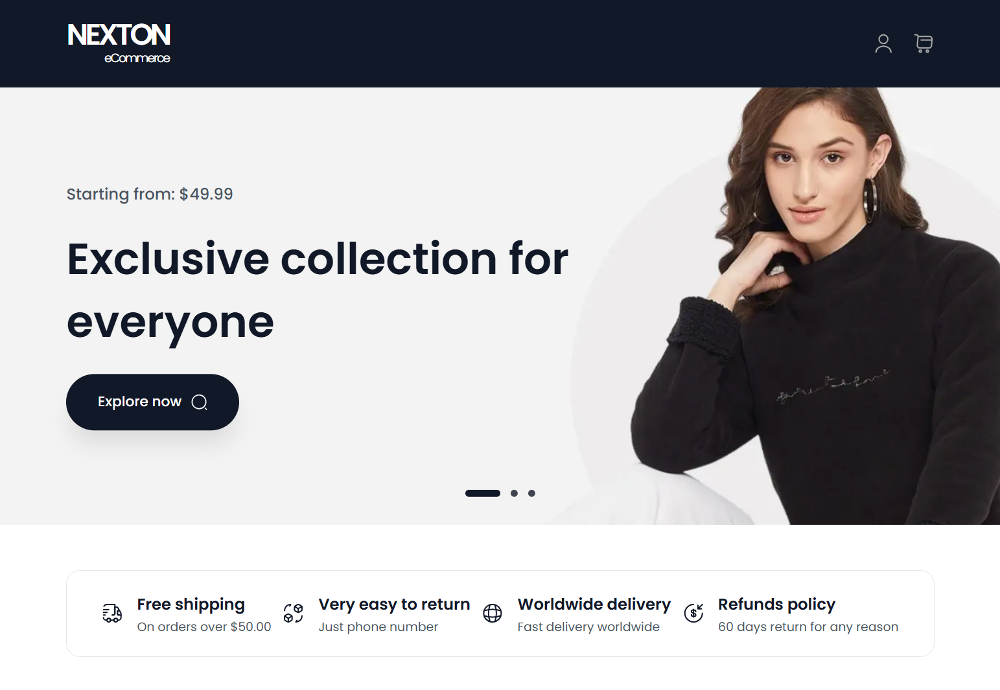

# Fashion Store 🛍️

Welcome to **Fashion Store**, a modern and fully responsive e-commerce web application for showcasing and selling fashion products. This project is built using **Next.js**, **TailwindCSS**, and other modern web technologies to provide a seamless shopping experience.

---

## Features 🌟

- **Home Page**: Highlights recommended products and categories.
- **Product Details**: Displays detailed information about each product, including images, price, and description.
- **Cart System**: Allows users to add, view, and manage items in their shopping cart.
- **Responsive Design**: Optimized for all devices, from mobile to desktop.

---

## Technologies Used 🛠️

- **Next.js**: Framework for server-side rendering and static site generation.
- **TailwindCSS**: Utility-first CSS framework for styling.
- **React Context API**: For state management of cart and user data.
- **API Integration**: Data fetched dynamically from [FakeStore API](https://api.escuelajs.co/).

---

## Installation and Setup 🚀

Follow these steps to run the project locally:

1. Clone this repository:
   ```bash
   git clone https://github.com/amirmousav1/NEXTON-eCommerce
   ```
2. Navigate to the project directory:
   ```bash
   cd NEXTON eCommerce
   ```
3. Install dependencies:
   ```bash
   npm install
   ```
4. Run the development server:
   ```bash
   npm run dev
   ```
5. Open your browser and go to:
   ```
   http://localhost:3000
   ```

---

## Screenshots 📸

### Homepage




### Product Details


### Cart


